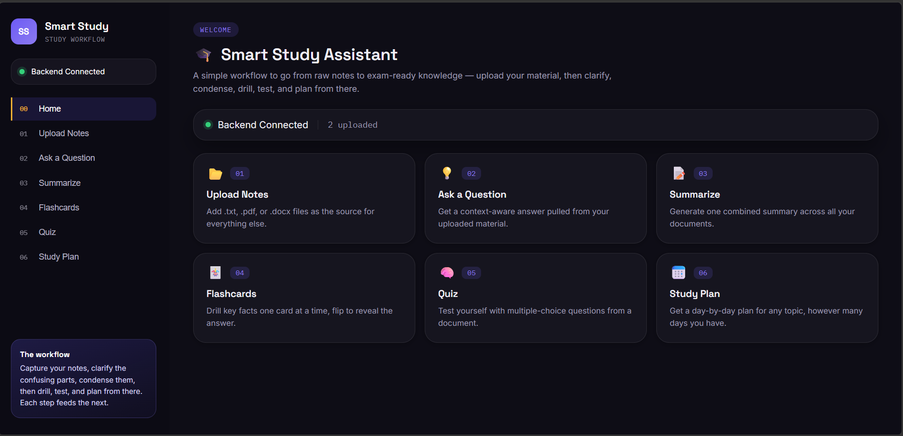
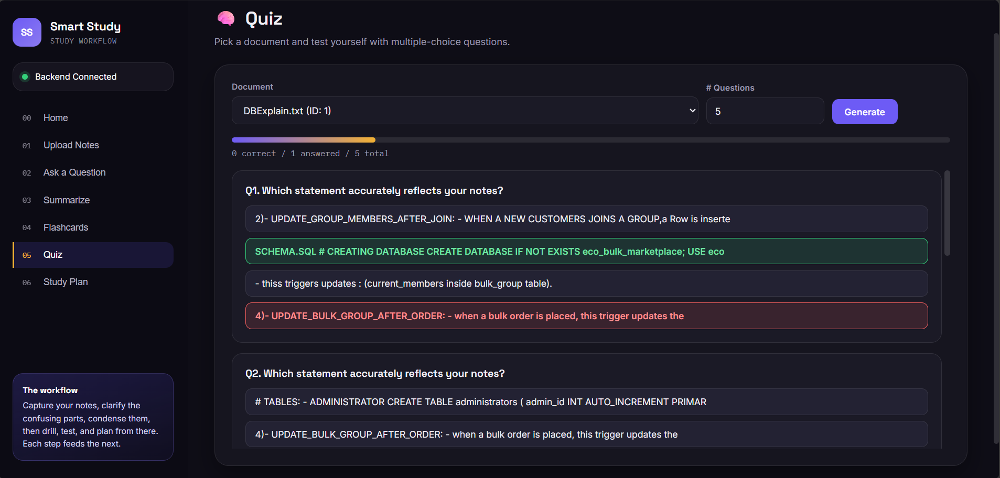
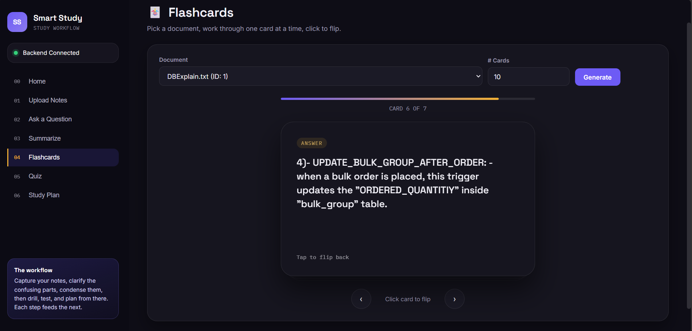

# 🎓 Smart Study Assistant

An AI-powered study workflow that takes you from raw notes to exam-ready knowledge — upload your material, then clarify, condense, drill, test, and plan, all in one place.

Built as a semester project for **AL2002	Artificial Intelligence - Lab**.

---

## ✨ Features

| Step | Description |
|------|--------------|
| 📂 **Upload Notes** | Upload `.txt`, `.pdf`, or `.docx` files as the source for everything else |
| 💡 **Ask a Question** | Get a context-aware answer pulled directly from your uploaded documents |
| 📝 **Summarize** | Generate a single combined summary across all uploaded documents |
| 🃏 **Flashcards** | Auto-generated flashcards for any document — flip to reveal the answer |
| 🧠 **Quiz** | Multiple-choice quizzes generated from your notes, with live scoring |
| 📅 **Study Plan** | A day-by-day study plan for any topic, scaled to however many days you have |

A **Home dashboard** ties everything together with quick shortcuts into each step, plus a live backend status and document count.

---

## 🖥️ Tech Stack

- **Frontend:** HTML, CSS, vanilla JavaScript
- **Backend:** Python (Fast API)
- **AI:** Google Gemini API — powers Q&A, summarization, flashcard, quiz, and study plan generation
- **Storage:** JSON-based document store (`uploaded_docs.json`)

---

## 📁 Project Structure

```
smart-study-assistant/
├── backend/
│   ├── main.py                  # Backend API entry point
│   ├── ai_service.py            # AI prompts & LLM calls (Gemini)
│   ├── flashcard_service.py     # Flashcard generation logic
│   ├── quiz_service.py          # Quiz generation logic
│   ├── storage.py               # Document storage handling
│   ├── document_service.py      # Document parsing (.txt/.pdf/.docx)
│   └── retrieval_service.py     # Context retrieval for Q&A
│
├── frontend/
│   ├── index.html               # Main UI
│   ├── app.js                   # Frontend JS for API calls
│   ├── style.css                # Custom dark-theme CSS
│   └── screenshot.png           # Interface screenshot
│
├── .env                         # Gemini API key & model config
├── uploaded_docs.json           # Stored uploaded documents
└── README.md
```

---

## 🚀 Getting Started

### 1. Clone the repo
```bash
git clone https://github.com/burair-hyder/Smart-Study-Assistant.git
cd smart-study-assistant
```

### 2. Set up the backend
```bash
cd backend
python -m venv venv
source venv/bin/activate   # on Windows: venv\Scripts\activate
pip install -r requirements.txt
```

### 3. Add environment variables
Create a `.env` file inside `backend/` with your Gemini API key and model:
```
GEMINI_API_KEY=your_api_key_here
GEMINI_MODEL=gemini-1.5-flash
```

### 4. Run the backend
```bash
python main.py
```

### 5. Open the frontend
Open `frontend/index.html` in your browser, or serve the `frontend/` folder as static files from the backend if it's configured to do so.

---

## 🧭 Workflow

The app is designed around one idea: **each step feeds the next.**

```
Upload Notes → Ask Questions → Summarize → Flashcards → Quiz → Study Plan
```

You don't have to follow the steps in order — the Home dashboard lets you jump straight to whichever step you need.

---

## 📸 Screenshots







---

## 🔮 Possible Future Improvements

- Dark/light theme toggle
- Progress tracking and quiz score history
- Export flashcards (CSV/Anki) and summaries (PDF/Markdown)
- Mobile-optimized navigation
- Document preview before generating content

---

## Group Members 🙋
🎓 Ammar Kamran Ali – 24K-0732 
🎓 Burair Hyder – 24K-0804
🎓 Mutahir Ahmed Khan – 24K-0030  
🎓 Sameed Imran – 24K-1036


---


